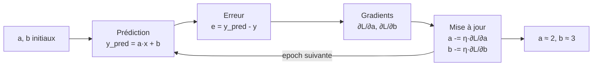

# Les maths de la descente de gradient

Ce document explique **pas à pas** le calcul qui permet au neurone d'apprendre.
Le but : comprendre d'où viennent les deux lignes de code :

```python
grad_a = 2 * np.mean(erreur * x)
grad_b = 2 * np.mean(erreur)
```

et pourquoi on met ensuite les poids à jour ainsi :

```python
a -= LEARNING_RATE * grad_a
b -= LEARNING_RATE * grad_b
```

---

## 1) Le modèle

Le neurone prédit une valeur à partir de l'entrée $x$ :

$$
\hat{y} = a\,x + b
$$

- $x$ : l'entrée (connue)
- $\hat{y}$ (`y_pred`) : la prédiction du modèle
- $a$, $b$ : les **poids** à apprendre (aléatoires au départ)

L'objectif est de trouver les valeurs de $a$ et $b$ qui rendent $\hat{y}$ le
plus proche possible de la vraie valeur $y$.

---

## 2) La fonction de perte (loss)

On mesure l'erreur avec l'**erreur quadratique moyenne** (MSE, *Mean Squared
Error*). Pour $N$ exemples :

$$
L(a, b) = \frac{1}{N} \sum_{i=1}^{N} \left( \hat{y}_i - y_i \right)^2
        = \frac{1}{N} \sum_{i=1}^{N} \left( a\,x_i + b - y_i \right)^2
$$

- On élève l'erreur au carré pour deux raisons :
  - les erreurs positives et négatives ne s'annulent pas ;
  - les grosses erreurs sont **fortement** pénalisées.
- On divise par $N$ pour obtenir une **moyenne** (indépendante du nombre de points).

Dans le code :

```python
def perte(y_pred, y):
    return np.mean((y_pred - y) ** 2)
```

Apprendre = **minimiser** $L(a, b)$.

---

## 3) L'idée de la descente de gradient

$L(a, b)$ est une surface en forme de « bol » (une parabole en 2D). Le point le
plus bas du bol correspond aux meilleurs poids.

Le **gradient** $\nabla L = \left( \dfrac{\partial L}{\partial a},
\dfrac{\partial L}{\partial b} \right)$ est un vecteur qui pointe dans la
direction de **plus forte montée** de la loss.

Pour **descendre** vers le minimum, on va donc dans le sens **opposé** au
gradient :

$$
a \leftarrow a - \eta \, \frac{\partial L}{\partial a}
\qquad
b \leftarrow b - \eta \, \frac{\partial L}{\partial b}
$$

où $\eta$ (êta) est le **learning rate** (`LEARNING_RATE = 0.01`), c'est-à-dire
la taille des pas.

---

## 4) Calcul des gradients (les dérivées)

On dérive $L$ par rapport à chaque poids. On pose l'erreur d'un exemple :

$$
e_i = \hat{y}_i - y_i = a\,x_i + b - y_i
$$

### Dérivée par rapport à $a$

On utilise la **règle de dérivation en chaîne** : dériver le carré, puis dériver
l'intérieur.

$$
\frac{\partial L}{\partial a}
= \frac{1}{N} \sum_{i=1}^{N} 2\,(a\,x_i + b - y_i) \cdot
  \underbrace{\frac{\partial (a\,x_i + b - y_i)}{\partial a}}_{=\,x_i}
= \frac{2}{N} \sum_{i=1}^{N} e_i \, x_i
$$

Autrement dit :

$$
\boxed{\;\frac{\partial L}{\partial a} = 2 \cdot \text{moyenne}(e_i \, x_i)\;}
$$

### Dérivée par rapport à $b$

Ici la dérivée de l'intérieur par rapport à $b$ vaut $1$ :

$$
\frac{\partial L}{\partial b}
= \frac{1}{N} \sum_{i=1}^{N} 2\,(a\,x_i + b - y_i) \cdot 1
= \frac{2}{N} \sum_{i=1}^{N} e_i
$$

Autrement dit :

$$
\boxed{\;\frac{\partial L}{\partial b} = 2 \cdot \text{moyenne}(e_i)\;}
$$

### Correspondance avec le code

Ces deux formules encadrées sont **exactement** les lignes du programme :

```python
erreur = y_pred - y            #  e_i  =  a*x_i + b - y_i
grad_a = 2 * np.mean(erreur * x)   #  ∂L/∂a  =  2 · moyenne(e_i · x_i)
grad_b = 2 * np.mean(erreur)       #  ∂L/∂b  =  2 · moyenne(e_i)
```

> Remarque : le facteur `2` est souvent absorbé dans le learning rate (certains
> codes utilisent une MSE en $\frac{1}{2N}$ pour le faire disparaître). Ici on le
> garde pour rester fidèle à la vraie dérivée.

---

## 5) La mise à jour des poids

Une fois les gradients connus, on fait **un pas** de descente :

$$
a \leftarrow a - \eta \, \frac{\partial L}{\partial a}
\qquad
b \leftarrow b - \eta \, \frac{\partial L}{\partial b}
$$

```python
a -= LEARNING_RATE * grad_a
b -= LEARNING_RATE * grad_b
```

Intuition du signe :

- Si $\dfrac{\partial L}{\partial a} > 0$, augmenter $a$ **augmenterait** la loss,
  donc on **diminue** $a$.
- Si $\dfrac{\partial L}{\partial a} < 0$, c'est l'inverse : on **augmente** $a$.

Dans les deux cas, on se rapproche du minimum.

---

## 6) La boucle d'entraînement

Un passage complet (une **epoch**) enchaîne :

1. **Prédiction** : $\hat{y} = a\,x + b$
2. **Erreur** : $e = \hat{y} - y$
3. **Gradients** : $\dfrac{\partial L}{\partial a}$, $\dfrac{\partial L}{\partial b}$
4. **Mise à jour** : $a \leftarrow a - \eta\,\partial_a L$, $b \leftarrow b - \eta\,\partial_b L$

En répétant sur `EPOCHS = 400` epochs, les poids descendent progressivement le
bol jusqu'à $a \approx 2$ et $b \approx 3$, et la loss diminue à chaque étape.



---

## 7) Le rôle du learning rate $\eta$

Le learning rate contrôle la **taille des pas** :

| Valeur de $\eta$ | Effet |
|------------------|-------|
| Trop petit (`0.001`) | Convergence **très lente**, il faut beaucoup d'epochs. |
| Bien réglé (`0.01`)  | Descente régulière vers le minimum. |
| Trop grand (`1.0`)   | Les pas sautent par-dessus le minimum : la loss **oscille ou diverge**. |

C'est le paramètre à essayer en premier dans la section « À expérimenter » du
[README](README.md).

---

## En résumé

- Le modèle : $\hat{y} = a\,x + b$.
- La loss : $L = \text{moyenne}\big((\hat{y}-y)^2\big)$.
- Les gradients : $\partial_a L = 2\,\text{moyenne}(e\,x)$ et $\partial_b L = 2\,\text{moyenne}(e)$.
- La règle d'apprentissage : $\theta \leftarrow \theta - \eta\,\partial_\theta L$.

Répétée assez de fois, cette règle simple suffit pour que le neurone
**apprenne** la relation cachée dans les données.
