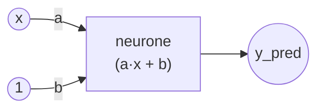

# TP 1 — Le neurone unique (régression linéaire)

## Objectif

Apprendre à un **seul neurone** à retrouver la relation :

```
y = 2x + 3
```

à partir de données générées (et légèrement bruitées).

Tout est fait **à la main avec NumPy**, sans framework d'IA, pour comprendre les
briques de base de l'entraînement :

- les **données** `(x, y)`
- la **fonction de perte** (loss) qui mesure l'erreur
- la **descente de gradient** qui ajuste les poids

## Le modèle

Un neurone unique calcule simplement :

```
y_pred = a * x + b
```

### Topologie du réseau



Une seule entrée `x`, un seul neurone, une seule sortie. Le poids `a` pondère
l'entrée et le biais `b` (branché sur une entrée constante `1`) décale la droite.

Au départ, `a` et `b` sont aléatoires. L'entraînement doit les faire converger
vers `a ≈ 2` et `b ≈ 3`.

## Comment ça marche

À chaque **epoch** (passage sur les données) :

1. On calcule la prédiction `y_pred = a*x + b`.
2. On calcule l'erreur `y_pred - y`.
3. On calcule le **gradient** (la pente de la loss selon `a` et `b`).
4. On déplace `a` et `b` dans le sens qui **fait diminuer la loss**.

La taille des pas est le **learning rate** (`0.01` ici).

## Lancer le TP (avec uv)

Depuis ce dossier :

```powershell
uv run main.py
```

`uv` remonte automatiquement au projet **à la racine du workspace** et utilise
l'environnement partagé (`.venv` unique). Les dépendances (`numpy`,
`matplotlib`) sont déclarées une seule fois dans le `pyproject.toml` racine :
aucun paquet n'est réinstallé par TP.

## Ce que tu dois observer

- La **loss diminue** au fil des epochs.
- Les **poids `a` et `b` évoluent** et se rapprochent de `2` et `3`.
- À la fin, la droite apprise (rouge) colle à la vraie droite (verte) dans
  `resultat.png`.

## À expérimenter

- Change le `LEARNING_RATE` : `0.001` (lent), `0.1` (rapide), `1.0` (ça diverge ?).
- Change `EPOCHS` pour entraîner plus ou moins longtemps.
- Augmente le `bruit` pour voir la robustesse.
- Modifie `A_VRAI` et `B_VRAI` : le modèle retrouve-t-il toujours la vérité ?
