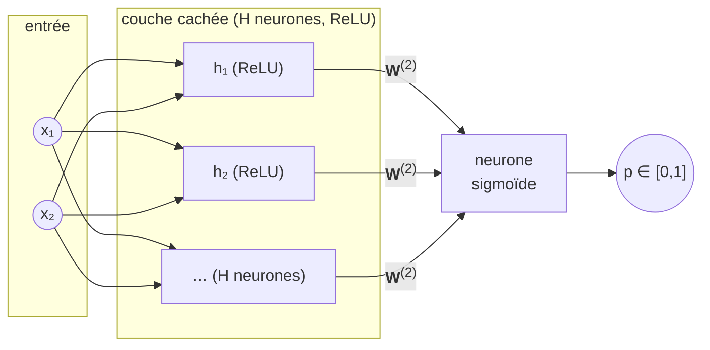

# TP 3 — Pourquoi plusieurs neurones ? Le XOR et la couche cachée

## Objectif

Comprendre **pourquoi un seul neurone ne suffit pas** pour certains problèmes,
et voir ce que change l'ajout d'une **couche cachée**.

Aux TP 1 et TP 2, un neurone unique faisait le travail. Mais un neurone ne sait
tracer qu'une **frontière droite** (une ligne). Le problème du **XOR** montre la
limite : ses quatre cas ne sont **pas séparables par une droite**.

```
 x2
  1 |  (0,1)=1        (1,1)=0
    |
  0 |  (0,0)=0        (1,0)=1
    +---------------------- x1
        0               1
```

Les classes `1` sont sur une diagonale, les classes `0` sur l'autre : aucune
droite ne peut mettre les `1` d'un côté et les `0` de l'autre. Il faut
**plusieurs neurones** organisés en couche.

On réutilise **exactement** la sigmoïde et la perte **BCE** du TP 2. La seule
nouveauté est la **rétropropagation** : faire remonter le gradient à travers la
couche cachée. Tout reste fait **à la main avec NumPy**.

## Le jeu de données : un XOR bruité

Le XOR « pur » n'a que 4 points, trop peu pour un vrai train/test ou une jolie
frontière. On remplace donc chaque coin par un **nuage de points** gaussiens
autour de ce coin (150 points par coin). La classe reste celle du coin.

On obtient un vrai jeu 2D, coupé en **entraînement (70 %)** et **test (30 %)**.

## Le modèle : `2 → H (ReLU) → 1 (sigmoïde)`

```
entrée (x1, x2)
      │
      ▼
couche cachée : H neurones, activation ReLU        (W1, b1)
      │
      ▼
sortie : 1 neurone, activation sigmoïde  → proba   (W2, b2)
```

### Topologie du réseau



Deux couches de poids au lieu d'une :

- $\mathbf{W}^{(1)}$ (2 × H) + $\mathbf{b}^{(1)}$ : de l'entrée vers la couche cachée ;
- $\mathbf{W}^{(2)}$ (H × 1) + $b^{(2)}$ : de la couche cachée vers la sortie.

> **Convention de notation.** Les **vecteurs** sont en **gras minuscule**
> ($\mathbf{x}$, $\mathbf{b}^{(1)}$, $\mathbf{z}^{(1)}$, $\mathbf{a}^{(1)}$), la
> **matrice** du batch et les matrices de poids en **gras MAJUSCULE**
> ($\mathbf{X}$, $\mathbf{W}^{(1)}$, $\mathbf{W}^{(2)}$), et les **scalaires** en
> maigre ($b^{(2)}$, $z^{(2)}$, $p$).

La couche cachée « replie » l'espace : chaque neurone caché trace **sa** droite,
et la sortie **combine** ces droites pour former une frontière **courbe** capable
de séparer le XOR.

### ReLU : l'activation de la couche cachée

Le neurone caché passe son score dans la fonction **ReLU** (*Rectified Linear
Unit*) :

```
relu(z) = max(0, z)      (garde le positif, écrase le négatif à 0)
```

Sa dérivée est très simple : `1` si `z > 0`, `0` sinon. C'est ce qui apparaît
dans la rétropropagation (`dz1 = da1 * (z1 > 0)`).

### Init aléatoire : briser la symétrie

Au TP 2, on initialisait les poids à **zéro**. Ici c'est **interdit** pour la
couche cachée : si tous les poids valent `0`, tous les neurones cachés calculent
la même chose et reçoivent le même gradient — ils resteraient **identiques pour
toujours** et la couche cachée ne servirait à rien.

On initialise donc les poids **au hasard** pour **briser la symétrie**. On
utilise l'initialisation **He** (`randn * sqrt(2/n_entrées)`), bien adaptée au
ReLU.

## La constante `H` : voir « pourquoi plusieurs neurones »

En haut de [main.py](main.py), `H` fixe le nombre de neurones cachés :

| `H` | Ce qu'on observe                                            |
| --- | ---------------------------------------------------------- |
| `8` | frontière **courbe**, XOR résolu (accuracy test ~100 %)    |
| `1` | un seul **pli**, XOR **non résolu** (accuracy ~75 %)       |

Avec `H = 1`, la couche cachée n'a qu'un seul neurone : elle ne trace qu'un
**unique pli** et sépare au mieux un coin sur deux (~75 %, loin des 100 %). La
démonstration qu'il faut **plusieurs neurones** pour replier l'espace assez de
fois.

## Comment ça marche

À chaque **epoch** :

1. **Passe avant** : $\mathbf{z}^{(1)} = \mathbf{X}\mathbf{W}^{(1)} + \mathbf{b}^{(1)}$,
   $\mathbf{a}^{(1)} = \operatorname{relu}(\mathbf{z}^{(1)})$, puis
   $\mathbf{p} = \sigma(\mathbf{a}^{(1)}\mathbf{W}^{(2)} + b^{(2)})$.
2. **Rétropropagation** : on part de l'erreur de sortie `p − y` (comme au TP 2)
   et on la fait **remonter** dans la couche cachée pour obtenir les gradients
   des 4 paquets de poids.
3. **Mise à jour** : on déplace `W1, b1, W2, b2` dans le sens qui fait diminuer
   la loss (descente de gradient, identique aux TP précédents).

Le détail mathématique (règle de la chaîne, dérivée du ReLU) est dans
[MATH.md](MATH.md).

## Lancer le TP (avec uv)

Depuis ce dossier :

```powershell
uv run main.py
```

Ou, depuis n'importe où dans le projet :

```powershell
mise run tp3
```

## Ce que tu dois observer

- La **loss diminue** sur l'entraînement **et** sur le test (le XOR bruité ne
  provoque pas de surapprentissage marqué ici).
- L'**accuracy test atteint ~100 %** avec `H = 8`.
- Dans `resultat.png`, la **frontière de décision est courbe** : elle épouse la
  diagonale du XOR, ce qu'une seule droite ne pourrait jamais faire.

## À expérimenter

- **Mets `H = 1` et relance.** La frontière n'a plus qu'un seul pli et l'accuracy
  plafonne vers ~75 % (loin des 100 %) : un seul neurone caché ne suffit pas à
  résoudre le XOR.
- Fais varier `H` (2, 4, 16) : combien de neurones faut-il au minimum pour que ça
  marche ?
- Change `ECART` (dispersion des nuages) : un XOR plus « flou » est-il plus dur ?
- Change `LEARNING_RATE` ou `EPOCHS`.
- Remplace le `relu` par une `sigmoid` dans la couche cachée : ça apprend-il
  encore ? plus vite ou plus lentement ?
